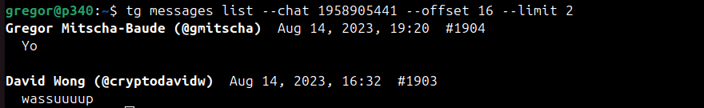

# tg

Telegram read access for agents. Linux and Mac. No login dance.

**Depends on Telegram Desktop being logged in on the same machine**. `tg` bootstraps a separate auth session from Telegram Desktop `tdata`, syncs selected history into a local SQLite cache, and serves read commands from that cache.

## Usage

Just install the [skill](https://github.com/mitschabaude/tg/tree/main/skills/tg) and ask your agent about your TG messages!

Requirements: Linux or Mac, git, Telegram Desktop, Node `>=23.6.0`, Python 3 with `uv`.

## How it works

`tg auth bootstrap` looks for Telegram Desktop `tdata` in common Linux and macOS locations. It copies `tdata` through a snapshot under `tmp/`, uses the Desktop authorization once to approve a QR-login token, and stores a separate Telethon session under `data/sessions/`. It also stores session metadata such as Telegram Desktop's effective downloads directory.

This is intentionally different from directly reusing TG Desktop's auth key. The agent session is a separate server-side authorization, so that sync operations don't mess with your TG Desktop client state.

After bootstrap, `tg sync` commands use the persistent client session to fetch chats/messages into a fast local SQLite cache, which serves all read requests like `tg messages list`. See the [skill](https://github.com/mitschabaude/tg/tree/main/skills/tg) for the list of available commands.

> [!WARNING]
> The local client session under `data/sessions/` gives an attacker Telegram account access equivalent to a locally logged-in Telegram Desktop client. The local cache under `data/cache/` can also contain sensitive message history. Treat both as private account data.
